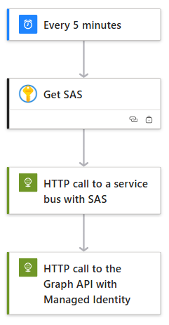
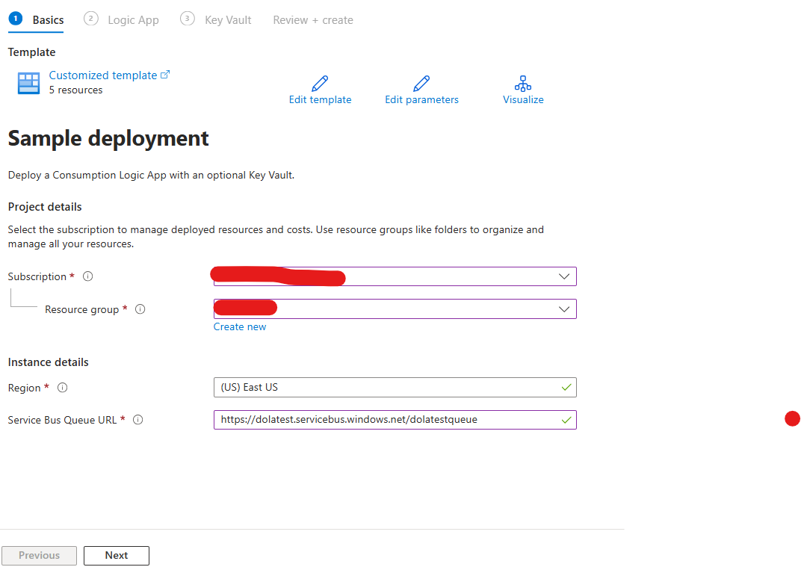
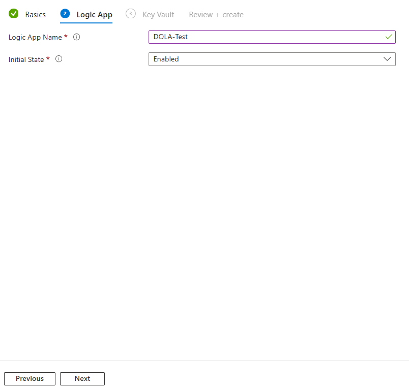
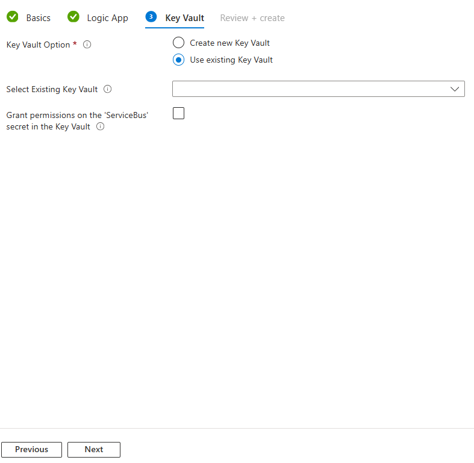
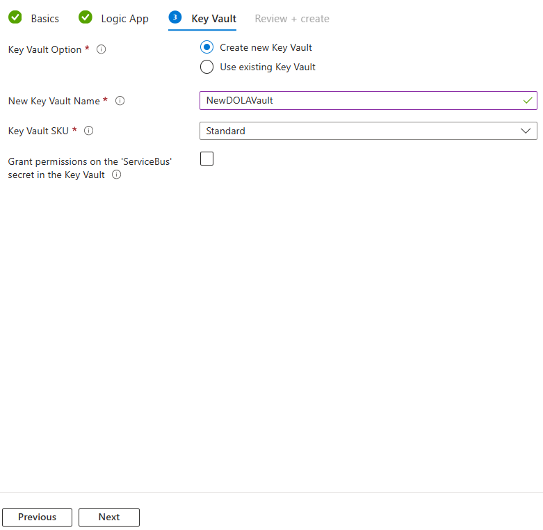

## 

### Sample logic app

The logic app workflow deployed by this solution does the following:
1. Runs every 5 minutes
2. Calls a Key Vault to retrieve a SAS to connect to a Service Bus using the Logic App own system managed identity  
3. Calls a Service Bus  using the SAS
4. Calls a Graph API endpoint using the Logic App own system managed identity 

This simple logic can be adapted to add/remove steps. Here is what the sample will look like in the editor view in the portal:

#### ℹ️ Design decisions

This Logic App doesn't use a Service Bus trigger. The Service Bus triggers requires the knowledge of the secret to be configured and does not allow to retrieve it from a key vault. Instead, the logic app will do like the trigger does, which is running every five minutes and read the Service Bus queue.   
It doesn't use the built-in Service Bus connectors for the same reason. Instead, it is using the built-in HTTP connector. 

The Key Vault contains a shared access signature (aka SAS), not the Service Bus secret key. You will need to create this signature and pick the policy and expiration according to your preferences and requirements. If you need an example of how to generate a SAS from a secret key, you can use this sample tool: [Generate-SAS-ServiceBus.ps1](tools/Generate-SAS-ServiceBus.ps1).

The Key Vault call and the Graph API call both use the system managed identity associated with the Logic App. You don't need to manage secrets for this but you need to grant permissions to the identity to:
1. Query the Key Vault (this is done by a deployement task but can also be done direcly on the Key Vault in Azure).
2. Query the Graph API 
`https://graph.microsoft.com/beta/deviceManagement` endpoint. API permissions cannot be set in a deployement task and there is no graphical interface to set those permissions in the Entra ID poral. For this operation, you can use PowerShell like this sample: [Set-API-Permissions.ps1](tools/Set-API-Permissions.ps1).

## Deployment

You can simply click on the following button and follow the instructions:

This will look like these steps:

Here you can either pick an existing Key Vault:

 Or chose to create a new one:

 
